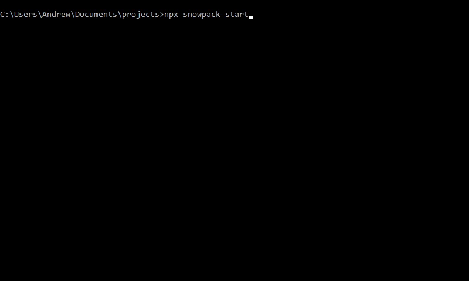
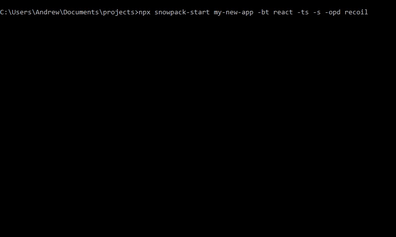
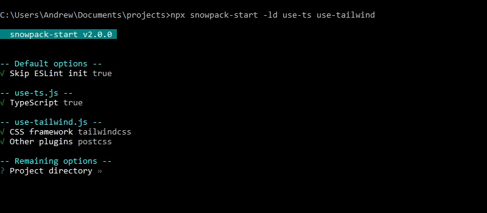
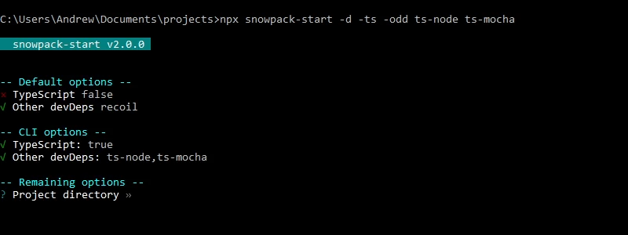

# snowpack-start

## ⚠️ WARNING ⚠️
Snowpack development [is currently on indefinite haitus](https://github.com/withastro/snowpack/issues/3491#issuecomment-920501647).

Consider switching to the actively maintained [Vite](https://vitejs.dev/).

<hr>

> [What is Snowpack?](https://www.snowpack.dev/)
>
> Snowpack is a lightning-fast frontend build tool, designed for the modern web. It is an alternative to heavier, more complex bundlers like webpack or Parcel in your development workflow.

The problem: manually customizing templates from [`create-snowpack-app`](https://github.com/snowpackjs/snowpack/tree/main/create-snowpack-app/cli) was annoying.

The solution: `snowpack-start` (`snowpack-init` was already taken). `snowpack-start` installs packages and generates configuration boilerplate so you can get to developing faster.

## New in v2.1.1

### 🚨 Breaking Changes
None

### ⚠️ Non-breaking Changes
`220210` — Added warning about Snowpack development

### 🔧 Fixes
`b8c564` — Fixed `svelte.config.js` generation

### 🏔️ Snowpack Template Changes
None

<br>

## Usage
Node version ≥ 10 is required.

```
$ npx snowpack-start [project-directory] [other-options]
```

All CLI options (including project directory) are optional.

With no CLI options:

<div>
    
    <!--  -->
</div>

<br>

With some CLI options:

<div>
    
    <!--  -->
</div>


Using all CLI options and skipping prompts entirely is also possible.

<br>

### CLI Options

#### CLI only
These can only be used on the command line.

| Syntax                                    | Description                  |
|-------------------------------------------|------------------------------|
| `-d, --defaults`                          | Use default options          |
| `-ld, --load <files...>`                  | Load options from files      |

#### Active

Prompts will be displayed for active options not otherwise provided on the command line.

| Syntax                                    | Description                  |
|-------------------------------------------|------------------------------|
| `-bt, --base-template <template>`         | Base template                |
| `-ts, --typescript`                       | Use TypeScript               |
| `-nts, --no-typescript`                   | Don't use TypeScript         |
| `--t, --testing <testing>`                | Testing                      |
| `-cdf, --code-formatters <formatters...>` | Code formatters              |
| `-s, --sass`                              | Use Sass                     |
| `-ns, --no-sass`                          | Don't use Sass               |
| `-cssf, --css-framework <framework>`      | CSS framework                |
| `-b, --bundler <bundler>`                 | Bundler                      |
| `-p, --plugins <plugins...>`              | Other plugins                |
| `-opd, --other-prod-deps <deps...>`       | Other prod dependencies      |
| `-odd, --other-dev-deps <deps...>`        | Other dev dependencies       |
| `-lc, --license <license>`                | License                      |
| `-a, --author <author>`                   | Author (for MIT license)     |

<br/>

| Option           | Valid Values                                         |
|------------------|------------------------------------------------------|
| Base template    | `blank`/`react`/`react-redux`/`vue`/`svelte`/`preact`/`lit-element` |
| Testing          | `wtr`/`jest`/`none`                                  |
| Code formatters  | `eslint`, `prettier`, `none`                         |
| CSS framework    | `none`/`tailwindcss`/`bootstrap`                     |
| Bundler          | `webpack`/`snowpack`/`none`                          |
| Other plugins    | `postcss`, `srs`, `sbs`, `none`                      |
| License          | `mit`/`gpl`/`apache`/`none`                          |

<br>

| Value     | Plugin                             |
|-----------|------------------------------------|
| `postcss` | `@snowpack/plugin-postcss`         |
| `srs`     | `@snowpack/plugin-run-script`      |
| `sbs`     | `@snowpack/plugin-build-script`    |

<br>

⚠️ Don't install `@snowpack/plugin-run-script` or `@snowpack/plugin-build-script` unless you have a reason to! They're not required to run Snowpack and are for additional processing that isn't already handled by existing plugins.

<br>

#### Passive

Passive options do not have prompts.

| Syntax                                    | Description                  |
|-------------------------------------------|------------------------------|
| `--use-yarn`                              | Use Yarn                     |
| `--no-use-yarn`                           | Don't use Yarn               |
| `--use-pnpm`                              | Use pnpm                     |
| `--no-use-pnpm`                           | Don't use pnpm               |
| `--skip-tailwind-init`                    | Skip TailwindCSS init        |
| `--no-skip-tailwind-init`                 | Don't skip TailwindCSS init  |
| `--skip-eslint-init`                      | Skip ESLint init             |
| `--no-skip-eslint-init`                   | Don't skip ESLint init       |
| `--skip-git-init`                         | Skip git init                |
| `--no-skip-git-init`                      | Don't skip git init          |

<br>

### Default Options
On startup, `snowpack-start` will look for a `.snowpackstart.js` file in the home directory. If it exists, then the options in that file are loaded as default options. Otherwise, the [built-in default options](https://github.com/awu43/snowpack-start/blob/master/src/defaults.js) are used.

Passive defaults will always be applied regardless of whether the defaults flag has been passed on the command line. Active defaults will only be applied if `-d` or `--defaults` has been passed. If not applied, active defaults will be set as the initial selections/values of their corresponding prompts.

<div>
    
    <!--  -->
</div>

<br>

### Loading Options From Files
Specify paths to files (extension optional), and options will be loaded from them:

<div>
    
    <!--  -->
</div>

<br>

### Order Of Operations
```
Defaults >> Files >> CLI >> Prompts
```

Later options overwrite earlier ones, with the exception of the other deps options:

<div>
    
    <!--  -->
</div>

The other deps options are instead additive, so later deps will be added to the existing deps. To clear previous deps, use `none` in files or CLI:

<div>
    
    <!--  -->
</div>

<br>

## Issues
### Known
* Jest configs for Snowpack are only available for React, Preact (JS+TS) and Svelte (JS only), and [do not yet support Jest 27](https://github.com/snowpackjs/snowpack/issues/3398).
* `eslint --init` only supports React and Vue, additional setup required for Svelte, Preact, and LitElement.
* `eslint --init` only installs packages with npm, no option to use Yarn or pnpm.
* Starting with Snowpack v3.1 and as of v3.8.8, image/JSON imports break builds using the built-in bundler ([#3109](https://github.com/snowpackjs/snowpack/issues/3109)). A [workaround](https://github.com/snowpackjs/snowpack/issues/3109#issuecomment-821514740) is automatically added if `snowpack` is selected as the bundler.

### Reporting
Please report any other issues [here](https://github.com/awu43/snowpack-start/issues).

<br>

## Acknowledgements
Portions of code have been adapted from [create-snowpack-app](https://github.com/snowpackjs/snowpack/tree/main/create-snowpack-app/cli) and [create-react-app](https://github.com/facebook/create-react-app/tree/master/packages/create-react-app).

Official app templates from `create-snowpack-app`, with configurations from community templates used.

React-Redux templates adapted from `create-react-app`.

## License
MIT
